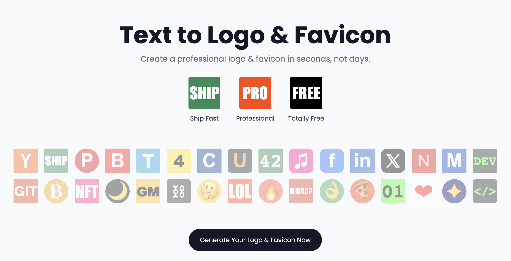

# Logo.surf - Text to Logo & Favicon Generator

[Visit Logo.surf](https://www.logo.surf)

> **Note**: This project is primarily developed using AI-generated code. While this approach allows for rapid development and innovative solutions, we encourage users and contributors to review and validate the code as needed.

Logo.surf is a free, user-friendly tool that allows you to quickly generate professional logos and favicons from text. Perfect for developers, designers, and anyone looking to create a simple yet effective brand identity.

## Features

- **Text-to-Logo Generation**: Create logos and favicons by simply entering your text.
- **Customization Options**: Adjust colors, fonts, sizes, and more to perfect your design.
- **Multiple Format Support**: Download your logo in various formats including PNG, SVG, and ICO.
- **Real-time Preview**: See changes to your logo in real-time as you make adjustments.
- **Completely Free**: All features are available at no cost.
- **No Account Required**: Start creating immediately without signing up.

## How to Use

1. Visit [Logo.surf](https://www.logo.surf)
2. Enter your desired text in the input field.
3. Customize your logo using the available options (color, font, size, etc.).
4. Preview your logo in real-time.
5. Once satisfied, download your logo in your preferred format.

## Related Products

Check out our other tools and services:

- [Awesome Flux AI](https://www.awesomefluxai.com) - Awesome Flux AI resources
- [DNS.fish](https://dns.fish) - Domain DNS lookup 
- [IP.network](https://www.ip.network) - IP address information and tools
- [Favicon.im](https://Favicon.im) - Grab Favicon of any website
- [Small.im](https://Small.im) - Image comperssor and converter
- [Query.domains](https://Query.domains) - Domain availability checker and whois lookup
- [RedirectCheck](https://www.redirectcheck.org) - URL redirect checker

## Contributing

We welcome contributions to Logo.surf! If you'd like to contribute, please follow these steps:

1. Fork the repository
2. Create your feature branch (`git checkout -b feature/AmazingFeature`)
3. Commit your changes (`git commit -m 'Add some AmazingFeature'`)
4. Push to the branch (`git push origin feature/AmazingFeature`)
5. Open a Pull Request

Please make sure to update tests as appropriate and adhere to the project's coding standards.

## License

This project is licensed under the Creative Commons Attribution-NonCommercial 4.0 International License - see the [LICENSE](LICENSE) file for details.

Key points:
- You can use, share, and adapt this work for non-commercial purposes.
- You must provide attribution and include a link to the original repository.
- Commercial use is prohibited.

For more information, visit: https://creativecommons.org/licenses/by-nc/4.0/

## Follow Us

Stay updated with our latest news and updates:

## Contact

If you have any questions, feel free to reach out or open an issue in the repository.

---

Made with ❤️ by Webmaster.Studio